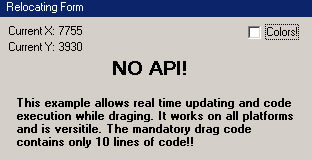



## Drag Borderless Form NO API

### Description

Allows for real time updating of objects and values while the drag is being proformed. Move a borderless form without api and in only 10 lines of code. Very easy to understand.
 
### More Info
 

             |
---                |---
**Submitted On**   |2004-06-29 13:38:32
**By**             |[John Harper](https://github.com/Planet-Source-Code/PSCIndex/blob/master/ByAuthor/john-harper.md)
**Level**          |Beginner
**User Rating**    |4.8 (29 globes from 6 users)
**Compatibility**  |VB 6\.0
**Category**       |[Custom Controls/ Forms/  Menus](https://github.com/Planet-Source-Code/PSCIndex/blob/master/ByCategory/custom-controls-forms-menus__1-4.md)
**World**          |[Visual Basic](https://github.com/Planet-Source-Code/PSCIndex/blob/master/ByWorld/visual-basic.md)
**Archive File**   |[Drag\_Borde1763796292004\.zip](https://github.com/Planet-Source-Code/john-harper-drag-borderless-form-no-api__1-54662/archive/master.zip)

